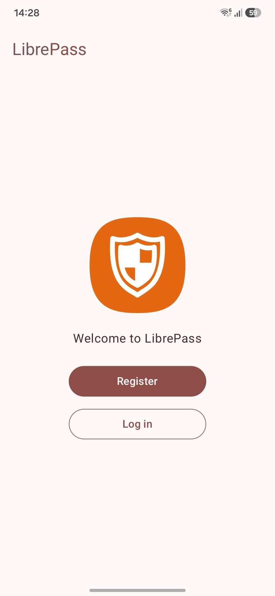
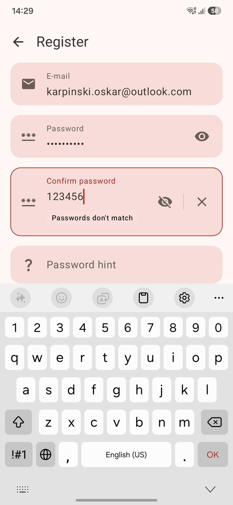
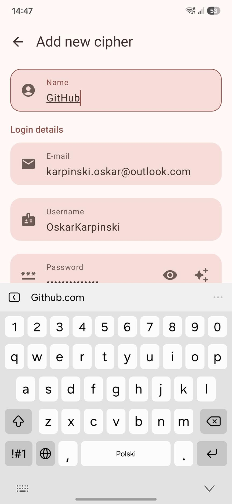
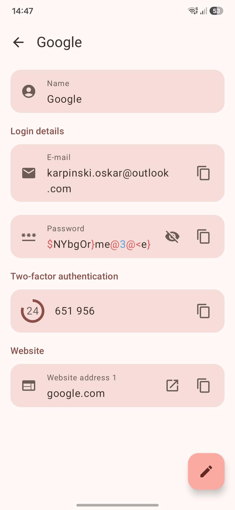
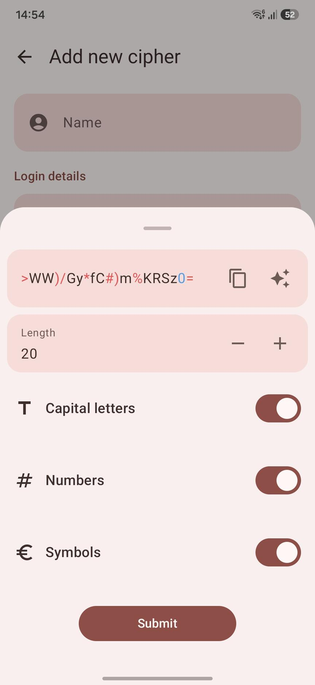

# LibrePass Android

> [!WARNING]  
> **Status: Unmaintained** — This project is no longer actively developed as of October 2024.

LibrePass Android is a cloud-based password manager built for Android with a focus on **simplicity, security, and performance**. The application provides users with a seamless way to generate, manage, and synchronize secure passwords across multiple devices.

---

## ⚠️ Project Status

This project was a **hobby project** that served as an incredible learning experience. It taught me valuable lessons about:

- **Modern Android development** with Kotlin and Jetpack Compose
- **Cryptography and security** implementation in mobile applications
- **Cloud synchronization** and backend integration patterns
- **Clean architecture** and modular project structure
- **Multi-module Android projects** with feature separation
- **User authentication** and biometric security
- **Dependency injection** with Dagger Hilt

While the project is no longer maintained, the codebase remains a testament to these learnings and serves as a reference implementation for many Android development practices.

---

## 📸 Screenshots

  
  
  
  
  

---

## 📱 Features

- ✅ **Advanced Password Encryption** — All passwords stored in an encrypted vault
- ✅ **Secure Password Generation** — Generate strong, unique passwords with customizable parameters
- ✅ **Biometric Unlock** — Face and fingerprint authentication (Android 9+)
- ✅ **Cross-Device Synchronization** — Sync passwords securely across devices via cloud
- ✅ **Material 3 Design** — Native Android 12+ system theme support with dynamic colors
- ✅ **QR Code Integration** — Support for TOTP (Time-based One-Time Password) scanning
- ✅ **Vault Auto-Lock** — Automatically lock vault after configurable inactivity period
- ✅ **Dark Mode** — Full dark mode support with Material 3
- ✅ **Offline Support** — Works offline with local database synchronization
- ✅ **Multi-Language Support** — Translations contributed by the community

---

## 📱 Availability

LibrePass Android was previously available on app stores but is **no longer maintained**:

- **F-Droid** — Previously available, removed due to project being unmaintained
- **IzzyOnDroid** — Previously available, removed due to project being unmaintained
- **GitHub Releases** — Historical releases still available for reference

---

## 🔐 Security

This application implements several security measures:

1. **Encrypted Storage** — All passwords encrypted using industry-standard algorithms
2. **Biometric Authentication** — Secure unlock using fingerprint/face recognition
3. **Automatic Vault Lock** — Vault locks automatically after period of inactivity
4. **HTTPS Communication** — Secure cloud synchronization over encrypted channels
5. **No Password Logging** — Passwords are never logged or persisted unencrypted

> **Note:** This is a hobby project. For production use, consider security audits and professional password managers with established security track records.

---

## 📄 License

This project is licensed under the **GNU General Public License v3.0** (GPL-3.0)

---

## 🔗 Related Projects

- **[LibrePass Server](https://github.com/LibrePass/LibrePass-Server)** — Backend of the LibrePass password manager

---

## 💡 What I Learned

This hobby project taught me invaluable lessons about:

### Android Development
- ✅ Modern Kotlin & Compose patterns for building responsive UIs
- ✅ Multi-module Android architecture with clean separation of concerns
- ✅ Jetpack components (Hilt, Navigation, Biometric, Lifecycle)
- ✅ User authentication flows and biometric integration
- ✅ Material Design 3 implementation and dynamic theming
- ✅ Building performant Android applications at scale

### Cryptography & Security
- ✅ Implementing end-to-end encryption in mobile applications
- ✅ Secure credential handling and storage practices
- ✅ Biometric authentication and secure unlock mechanisms
- ✅ HTTPS communication and secure data synchronization
- ✅ Password generation algorithms and best practices
- ✅ Security considerations in real-world applications

### Architecture & Best Practices
- ✅ Cloud synchronization patterns and offline-first architecture
- ✅ Dependency injection with Dagger Hilt at scale
- ✅ Community localization and internationalization
- ✅ Multi-module project structure and gradle organization

This project was a comprehensive learning experience that combined practical Android development with real-world security challenges. It provided insights into how modern password managers work and the complexity involved in securing user data.

---

**Built with ❤️ as a learning experience in Android development**
